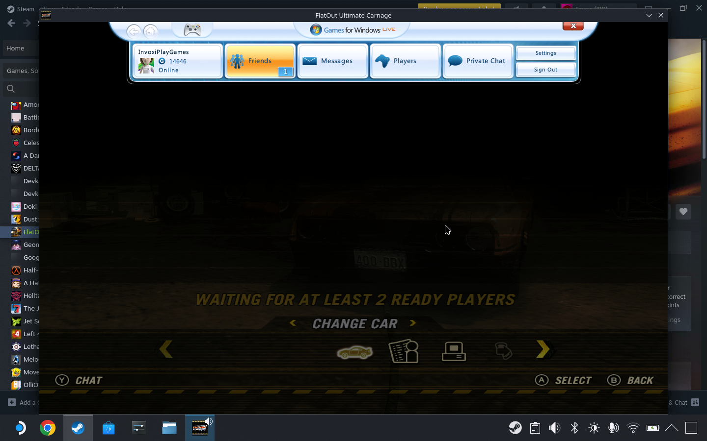

# Games for Linux - LIVE (GfLL) DLL

A DLL to get Games for Windows - LIVE working, and connected to the Xbox
network, on Linux and macOS.

## Currently not ready for use, yet.

## Warnings

### Product Key Reuse

Product keys on Games for Windows - LIVE for most games are attached to "PCID"s.
Under Wine, these IDs can change per-prefix, potentially leading to product keys
being redeemed several times and having their limited uses exhausted.

If using this DLL manually, keep registry backups of your Wine prefixes and
don't enter a product key unless you're sure you're using the same PCID - this
can be checked by checking the "PCID" value in 
`HKEY_CURRENT_USER\Software\Classes\Software\Microsoft\Xlive`.

**I am not responsible if your games product keys are made useless.**

(This does not apply to games that use "Server-Side Activation" - product keys
get attached to Microsoft accounts and are thus not subject to PCID usage
limits.)

### Bans

**I am not responsible if you get banned from the Xbox network for using this.**

That being said, it is very unlikely you will get banned for using this. None of
the anti-tamper checks are being triggered, no code inside xlive.dll is being
modified, and Microsoft disabled "challenges" - code blobs sent by the server
that check the integrity of the game and xlive.dll - many, many years ago.

## Compiling

Currently, compiling the project requires a Windows PC and Visual Studio 2022.
`gfll.sln` should build out of the box.

If you're interested in contributing, a new build system that builds under
Linux would be appreciated.

## Tested Games

* FlatOut Ultimate Carnage (works, but low framerate in LIVE lobbies)

## Manual Installation

1. Set up a new Wine prefix.
    * Wine/Proton version 9 or higher recommended.
    * Windows version 8.1 or 10 recommended, 7 might work.
    * It's recommended to either use one prefix for exclusively GfWL games, or
      a different prefix per-game.
    * Esync and Fsync **must** be disabled.
2. Collect and install some prerequisite DLLs into the prefix.
    * Microsoft IDCRL v5.0.891.1 (`msidcrl40.dll`) - 32-bit
        * This can be found in the Windows Live Messenger 2009
          14.0.8117.0416 installer.
        * Other v5 versions may work -
          **v6+ will not work due to WLIDSVC issues.**
        * Rename this to `msidcrl67.dll` and place it in a folder
          **outside of C:\Windows**.
    * Microsoft ASN.1 Runtime APIs (`msasn1.dll`) - 32-bit
        * This can be found in Windows 2000 Service Pack 4 installer.
    * Visual C++ Redistributable (2015-2022) (`vcruntime140`) - 32-bit
        * https://aka.ms/vs/17/release/vc_redist.x86.exe
    * Other dependencies may include `msxml3`, `urlmon` and `iertutil`,
      depending on Wine version.
3. Install the latest Games for Windows - LIVE runtime (v3.5.98.0) into the
   prefix.
    * `content/xliveredist.msi`:
      http://download.xbox.com/content/585207d1/tu10177600_35005f00.cab
4. Compile the GfLL dll and place it in the same folder you copied
   `msidcrl67.dll` to.
5. Create the registry key
   `HKEY_CURRENT_USER\Software\Wow6432Node\Microsoft\IdentityCRL` and create
   a new string value named `TargetDir`, pointing at the directory the
   msidcrl DLLs are contained in.
6. If you've played a GfWL game before, set a binary value `PCID` in `HKEY_CURRENT_USER\Software\Classes\Software\Microsoft\Xlive` to match your previous game's prefix, or a Windows PC that's used the product key before.
7. Launch a Games for Windows - LIVE game. It should work.

## Troubleshooting

### "Live initialization failed" or similar / game immediately closes

This can mean either the original msidcrl DLL or GfLL DLL isn't working
properly, or you're using a cracked copy of a game.

* Set your Wine prefix's Windows version to Windows 8.1 or 7.
* Make sure you have the Visual C++ Redistributable 2015-2022 installed.
* Make sure you have urlmon and iertutil installed in your Wine prefix.
* Make sure Windows Live ID Assistant is **not** installed. If version 6.5 is
  installed you might have to manually uninstall it and remove the service.
* Find an original, un-tampered executable for the game.

### "The Windows Live ID you entered does not exist or your password is incorrect"

This issue happens if your account has a password longer than 16 characters or
has two-factor authentication enabled.

Create an app password for your Microsoft account at
https://account.live.com/proofs/manage/additional
and use this to sign in to Games for Windows - LIVE.

### Game crashes after signing in to Windows Live ID

You're likely missing the official Microsoft msasn1.dll. Install this dependency
with Winetricks/Protontricks then try again.

### Wine prefix takes a long time to start / Steam never launches the game

You likely have installed the 6.5 version of the Windows Live ID login service,
which doesn't function under Wine. Uninstall this from your Wine prefix and
either run GfWL Utility again or follow the manual installation guide above.

## Patch Descriptions

### WinSock2 patches

Games for Windows - LIVE uses `WSALookupServiceBeginA` with the "gethostbyname"
service to do DNS lookups. This isn't implemented in Wine, so it gets
implemented here.

Implemented in [winsock.c](winsock.c).

### WinHTTP patches

When the runtime tries looking up anything at `services.gamesforwindows.com`
(for example, a product key), the service doesn't respond and the runtime has to
wait 2 minutes for a timeout. A patch is made to WinHTTP to deny connections to
that domain entirely.

Implemented in [winhttp.c](winhttp.c).

### IDCRL patches

The version of MSIDCRL we use (5.0.891.1) has an issue (TODO: check whether it
is a Wine issue) where the `AuthIdentityToService` call to authenticate a
logged in user to a given service, like Xbox network, makes an invalid request
to the RST2 endpoint.

The `LogonIdentityEx` function is hooked to instead request a token for Xbox
network while logging in with the user password rather than at
`AuthIdentityToService`, and the latter is hooked to always check for a
cached token rather than request a new token with saved credentials.

Implemented in [idcrl.c](idcrl.c).

## License

GfLL's DLL is licensed under the GNU General Public License version 2.
Please see the [LICENSE](LICENSE.txt) file for more information.

GfLL uses [MinHook](https://github.com/TsudaKageyu/minhook).
License information is available in
[thirdparty/LICENSE_MinHook.txt](thirdparty/LICENSE_MinHook.txt).
